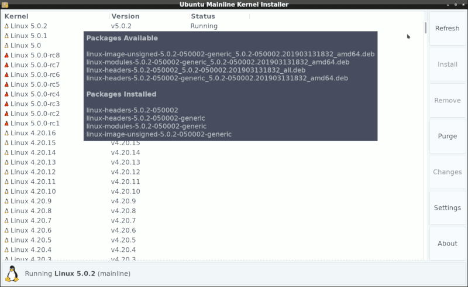

### Ubuntu Kernel Update Utility (Ukuu)

This is a tool for installing the latest mainline Linux kernel on Ubuntu-based distributions.



### Features

* Fetches list of available kernels from [Ubuntu Mainline PPA](http://kernel.ubuntu.com/~kernel-ppa/mainline/)
* Optionally watches and displays notifications when a new kernel update is available
* Downloads and installs packages automatically
* Display available and installed kernels conveniently
* Install/remove kernels from gui
* For each kernel, the related packages (headers & modules) are installed or removed at the same time

### Downloads & Source Code
Ukuu is written using Vala and GTK3 toolkit. Source code and binaries are available from the [GitHub project page](https://github.com/aljex/ukuu).

### Build
		sudo apt install libgee-0.8-dev libjson-glib-dev libvte-2.91-dev valac
		git clone https://github.com/aljex/ukuu.git
		cd ukuu
		make
		sudo make install

### About This Fork
The original author stopped maintaining the original GPL version of ukuu and switched to a [paid license](https://teejeetech.in/tag/ukuu/) for future versions. So, several people have forked that project, and this is one.

### Enhancements / Deviations from the original author's final GPL version

* (from [stevenpowerd](https://github.com/stevenpowered/ukuu)) Option to skip internet connection check
* (from [cloyce](https://github.com/cloyce/ukuu)) Option to include or hide pre-release kernels
* Removed all GRUB options
* Removed all donate buttons, links, dialogs

### Development Plans / TODO
* Stop consuming over 5GB in ```~/.cache/ukuu``` with kernel package files
:Until then: As a work-around, "ukuu --clean-cache" deletes the cache
* Better (more automatic) initial sizes for the window and the columns in the kernel list display so you don't have to manually expand them
* More efficient download & caching of info about available kernels, without the kernel packages
* Clean up build warnings
* Clean up run-time GTK warnings
* Make http client configurable (curl/wget/other)
* Reduce dependencies, stop using aptitude just to query installed packages when you can get the info from apt or even dpkg, use the same download client for everything instead of using both curl and aria
* Customizable appearance
* Option to specify kernel variant (generic, lowlatency, snapdragon, etc...)
* Configurable version threshhold instead of arbitrary hard-coded "hide older than 4.0"
* Improve the annoying pkexec behavior. It would be nicer to run lxqt-sudo or gsudo or pkexec etc one time for the whole session, and only have to enter a password once, instead of once per user action. But currently, if you do that, it creates files in the users home directory that are owned by root, which the user cannot then remove.
